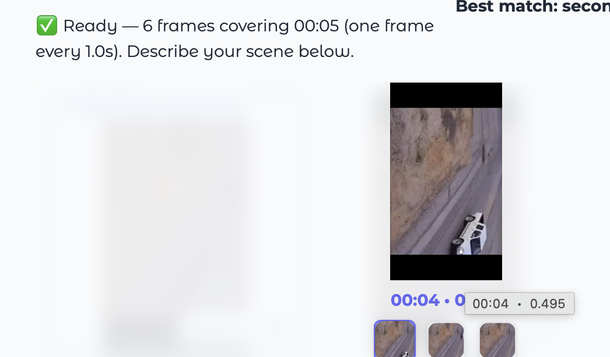

# WeMM-Embedding

A playground for **multimodal embedding models**, and a working project built on
top of one: **searching inside video with natural language**.

Type *"a white car driving down the road"* and get back the **second** it appears —
no OCR, no object detection, no pre-existing tags.

---

## What is an embedding?

One idea explains everything: **turning meaning into numbers**.

```
"Arabic coffee is served with dates."  ──►  [0.069, 0.006, 0.029, ..., 0.010]
                                                    4096 numbers
```

That list is called a **vector**, and it is the text's coordinates in a "space of
meaning". Texts that mean similar things land near each other in that space, so
comparing them becomes simple arithmetic (cosine similarity).

**What makes WeMM special:** it places **images, video, and text in the same
space**. You can compare a sentence directly against an image — and that is the
foundation of this entire project.

---

## A real example

Below is a test image from this repo. The scores are from an actual run:


| Score | Query | Verdict |
|---|---|---|
| **0.5788** | `a modern residential building facade` | ✅ The dominant content |
| **0.5328** | `سيارات سوداء مصفوفة أمام مبنى` (black cars lined up in front of a building) | ✅ Correct |
| **0.4208** | `وانيت أبيض واقف في الشارع` (a white pickup parked on the street) | ✅ Present, but a small detail |
| **0.4201** | `a white pickup truck parked on the street` | ✅ Same sentence, in English |
| 0.2470 | `قطة تنام على أريكة` (a cat sleeping on a couch) | ❌ Not present |
| 0.0859 | `a snowy mountain landscape` | ❌ Not present at all |

**Look at rows 3 and 4:** the same meaning in two different languages, and the gap
between them is only **0.0007**. The model does not compare words — it compares
meaning.

---

## The project: search inside a video

### How it works

```
🎥 Video
     │  PyAV — extract one frame per second
     ▼
[t=0s] [t=1s] [t=2s] … [t=57s]          each frame is an image tagged with its time
     │  WeMM — encode every frame
     ▼
 a 4096-d vector per frame
     │
❓ "a white car driving down the road" ──WeMM──► vector
     │  cosine between the query and every frame
     ▼
 best match = second 23  ← the answer
```

### Why frames instead of the whole video?

Encoding a whole video produces **a single vector** that carries no temporal
information. It tells you the video is "about cars" but never **when**. Pinpointing
a moment requires slicing it up.

---

## Walkthrough

**1. Open the interface** — upload a clip and pick a frame rate.


**2. Index the clip** — frames are extracted and encoded. Here a 5-second clip
produced 6 frames. The query below is Arabic: *"a white Nissan car"*.


**3. Search** — the Arabic query matched **second 4** with a score of **0.495**,
and the gallery shows the matching frames so you can verify by eye.



**4. Inspect a frame** — click any result to enlarge it. The white pickup truck is
clearly there at `00:04`.


> Note the score: **0.495**. It found the right frame, but the value sits just
> below the ~0.5 "strong match" line. Small objects in a wide aerial shot score
> lower than scenes that fill the frame — always read the score, not just the rank.

---

## Libraries

| Library | Role |
|---|---|
| `sentence-transformers` | Loads the model, encodes text and images |
| `transformers` | The underlying model architecture (Qwen3.5) |
| `torch` | Compute — uses MPS on Apple Silicon |
| `qwen-vl-utils` | Prepares image and video inputs |
| `av` (PyAV) | Video decoding — ships FFmpeg inside the wheel |
| `gradio` | Web interface |
| `numpy` / `scikit-learn` | Similarity math |

**Model:** [`tencent/WeMM-Embedding-9B`](https://huggingface.co/tencent/WeMM-Embedding-9B)
— built on Qwen3.5-9B, outputs a normalized 4096-d vector, accepts text, images,
and video. Download size ~17.5 GB, fetched automatically on first run.

> Lighter variants exist if resources are tight: `WeMM-Embedding-2B` and `-4B`.

---

## Setup and running

### 1. Environment

Requires **Python 3.10+**. We use [uv](https://docs.astral.sh/uv/) because it needs
no admin rights:

```bash
curl -LsSf https://astral.sh/uv/install.sh | sh
uv python install 3.12
uv venv --python 3.12 .venv
uv pip install -r requirements.txt
uv pip install -r project/requirements.txt
```

### 2. Launch the video search interface

```bash
./project/run.sh
```

Opens at `http://127.0.0.1:7860`.

**Steps:** upload a clip → click **Index clip** and wait for the progress bar →
describe the scene → **Search**. Indexing happens once; every search after that
returns in under half a second.

> ⚠️ Keep the terminal open — the server lives inside it. Closing it gives you
> `ERR_CONNECTION_REFUSED` in the browser.

### 3. Try embeddings on their own

```bash
.venv/bin/python scripts/run_benchmark.py --provider wemm --model tencent/WeMM-Embedding-9B
```

Or open `notebooks/wemm_playground.ipynb` for a hands-on, step-by-step tour.

---

## Local text retrieval and BGE reranking — 20 September 2026

Today we connected a local BGE reranker to the text retrieval evaluation harness,
added CLI options, saved separate results, and ran the complete pipeline locally.
We initially considered Jev, but account access was invite-only, so this
implementation uses `BAAI/bge-reranker-v2-m3`. No Jev integration is included.

### What the two models do

```text
Question + document corpus
    → Ollama bge-m3: create embeddings
    → cosine similarity: rank all documents
    → take the first 10 candidates
    → BGE reranker: score each question/document pair
    → reorder those candidates, retain the remaining documents in their original order
    → evaluate against the known correct document IDs
    → save a JSON result
```

`bge-m3` retrieves candidates using vectors. `BAAI/bge-reranker-v2-m3`
reads each question together with a candidate document and produces a relevance
score. Higher scores mean greater relevance; negative scores are normal and are
not percentages. The correct-answer IDs are used only to calculate metrics.

This text evaluation currently runs in the terminal. The existing Gradio browser
interface in `project/app.py` is for video search and does not expose this reranker.

### Files and responsibilities

| File | Responsibility |
|---|---|
| [harness/datasets/text_retrieval_v1.yaml](harness/datasets/text_retrieval_v1.yaml) | Evaluation data: 12 documents, 8 Arabic/English questions, and correct document IDs. |
| [harness/datasets/__init__.py](harness/datasets/__init__.py) | Loads YAML, normalizes text, and checks document IDs and answer references. |
| [harness/contract.py](harness/contract.py) | Defines a provider/model configuration with separate query and document embedding methods. |
| [harness/registry.py](harness/registry.py) | Connects the embedding providers to the harness and supplies registered model prefixes and limits. |
| [src/providers/ollama_embed.py](src/providers/ollama_embed.py) | Calls the local Ollama service to generate embeddings. |
| [src/rerankers/bge.py](src/rerankers/bge.py) | Loads and caches the reranker, scores candidates in batches of 8, and sorts them by relevance. Uses MPS when available, otherwise CPU; inputs are truncated to 512 tokens. |
| [src/rerankers/__init__.py](src/rerankers/__init__.py) | Marks the rerankers directory as a Python package. |
| [scripts/try_reranker.py](scripts/try_reranker.py) | Small standalone example to check model loading and Arabic relevance ranking. |
| [harness/tasks/text_retrieval.py](harness/tasks/text_retrieval.py) | Runs retrieval and optional reranking, validates returned IDs, calculates metrics, and records original rankings and timing. |
| [harness/metrics/retrieval.py](harness/metrics/retrieval.py) | Implements Success@k, Recall@k, MRR, NDCG@k, and recall ceilings. |
| [harness/runner.py](harness/runner.py) | Dispatches the task, saves JSON, and renders comparison tables. |
| [scripts/run_eval.py](scripts/run_eval.py) | CLI entry point for selecting models, enabling reranking, and printing results. |
| [results/](results/) | Saved metrics, model settings, timing, and per-question rankings. |

### Run it step by step

Run these commands from the repository root, after completing the environment
setup above. Use Python 3.11 or newer for the harness; the project's Python 3.12
environment works. Ollama must be installed and running locally, with `bge-m3`
available. The reranker uses the existing PyTorch and Transformers dependencies.

1. Run the embedding-only baseline:

   ```bash
   .venv/bin/python scripts/run_eval.py --provider ollama --model bge-m3 --reranker none --verbose
   ```

2. Try the reranker by itself:

   ```bash
   .venv/bin/python scripts/try_reranker.py
   ```

   The first run downloads the model from Hugging Face; later runs reuse the
   local cache. The electricity-saving example should rank the insulation and
   air-conditioning passage first.

3. Run retrieval followed by reranking of the top 10 candidates:

   ```bash
   .venv/bin/python scripts/run_eval.py --provider ollama --model bge-m3 --reranker bge --candidate-k 10 --verbose
   ```

   After the model is cached, force Hugging Face offline mode with:

   ```bash
   HF_HUB_OFFLINE=1 .venv/bin/python scripts/run_eval.py --provider ollama --model bge-m3 --reranker bge --candidate-k 10 --verbose
   ```

   `--candidate-k` must be positive. If it exceeds the corpus size, every document
   is reranked. Documents outside the shortlist retain their original order.
   A reranker cannot promote an answer it never receives into the shortlist.

4. Inspect saved comparisons and run the existing tests:

   ```bash
   .venv/bin/python scripts/run_eval.py --table --full
   .venv/bin/python -m pytest -q
   ```

   The table reads every matching JSON in `results/`, so the preserved
   `baseline_bge-m3.json` copy may appear alongside the original baseline row.

### Results measured today

Comparison with the saved [baseline](results/baseline_bge-m3.json):

| Metric | Embeddings only | With BGE reranking |
|---|---:|---:|
| Success@1 | 1.000 | 1.000 |
| MRR | 1.000 | 1.000 |
| NDCG@5 | 0.983 | 1.000 |
| Recall@3 | 0.958 | 1.000 |
| Recall@5 | 1.000 | 1.000 |

For question `q03` (reducing the electricity bill), correct document `d09`
moved from fifth to third. For `q06` (semantic similarity), correct document
`d10` moved from third to second.

The latest local run recorded **52.2 ms per question** for reranking and
**0.962 seconds** for reranker warm-up. Embedding time was **11.8 ms per text**;
this is a separate measurement, not end-to-end query latency. An earlier run
recorded 133.1 ms per question for reranking, so timings should be treated as
individual observations rather than a stable benchmark.

Recall@1 remained 0.6042, which is the maximum achievable on this dataset:
several questions have multiple correct documents but only one can occupy first
place. Perfect scores here cover only 8 questions and 12 documents. A larger,
harder held-out dataset is needed before drawing broader quality conclusions.

### Saved output and verification

The reranked result is saved to:

```text
results/text_retrieval__text_retrieval_v1_v1__ollama__bge-m3__rerank-bge__k10.json
```

The suffix keeps it separate from the embedding-only result. Repeating the same
configuration replaces its result file, so copy it before a run if you need to
preserve that observation.

Each reranked query records `top5`, `baseline_top5`, `baseline_mrr`, and
`rerank_scores`. The result also includes reranker settings and separate warm-up
and inference timings. The NDCG field now follows the requested cutoff instead
of always being labeled `ndcg@5`.

Verification completed: the real local evaluation, all four existing pytest
tests, and the commit hooks (including Ruff, formatting, and secret checks).
An additional in-memory check exercised optional loading, candidate ID
validation, preservation of the unreranked tail, and a custom NDCG cutoff;
that check is not a committed test file.

---

## Structure

```
WeMM-Embedding/
├── src/providers/          # one wrapper per embedding provider
│   ├── wemm_embed.py       #   WeMM — text, images, video
│   ├── hf_embed.py         #   generic sentence-transformers
│   └── ollama_embed.py     #   local Ollama models
├── src/compare.py          # cosine similarity and ranking
├── project/                # 🎬 the video search project
│   ├── video_search.py     #   frame extraction + encoding + search
│   ├── app.py              #   Gradio interface
│   └── run.sh              #   launcher with absolute paths
├── notebooks/              # interactive learning notebook
├── dataset/                # test images and screenshots
└── scripts/run_benchmark.py
```

---

## Practical notes

**Performance** (Apple M5 Max): ~13 s to load the model once, then ~0.37 s to
encode each frame. One minute of video at 1 fps ≈ 22 s of indexing.

**Frame rate is the core trade-off.** The default is one frame per second — but
**a fast-moving car may appear for less than a second and be missed entirely**.
Raise it to 2 or 4 for quick scenes.

**Read the score, not the rank.** The system always returns its best matches, even
when the scene is absent. From the runs above: above **0.5** is a strong match,
below **0.30** usually means it is not there.

**Detailed descriptions work better.** "car" alone is a weak signal; "a white car
driving down an asphalt road" performs noticeably better.

**Video decoding on macOS:** `decord` and `torchcodec` do not work on Apple Silicon
without extra system dependencies, so this project uses `PyAV`, which bundles
FFmpeg.

---

## License and usage

The model comes from Tencent under its own license — see
[its Hugging Face page](https://huggingface.co/tencent/WeMM-Embedding-9B).
This repository is for personal experimentation and learning.
