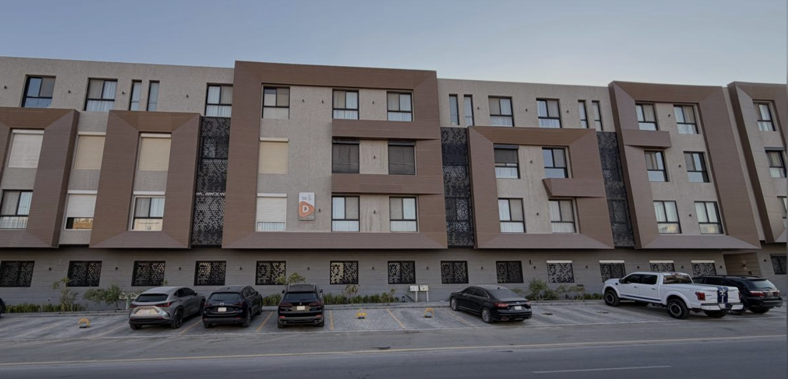

# WeMM-Embedding

مستودع لتجربة **نماذج الـ Embedding** متعددة الوسائط، وبناء مشروع عملي فوقها:
**البحث داخل مقاطع الفيديو بلغة طبيعية**.

اكتب «سيارة بيضاء مرت على الطريق» فيرجع لك **الثانية** التي ظهرت فيها — بدون
OCR، وبدون كشف أجسام، وبدون أي وسوم مُعدّة مسبقًا.

---

## ما هو الـ Embedding؟

فكرة واحدة تشرح كل شيء: **تحويل المعنى إلى أرقام**.

```
"القهوة العربية تُقدَّم مع التمر."  ──►  [0.069, 0.006, 0.029, ..., 0.010]
                                              4096 رقمًا
```

هذه القائمة تُسمى **متجهًا (vector)**، وهي إحداثيات النص في «فضاء المعاني».
النصوص المتقاربة معنويًا تقع قريبة من بعضها في هذا الفضاء، فتصبح المقارنة
بينها عملية حسابية بسيطة (cosine similarity).

**وما يميز WeMM تحديدًا:** أنه يضع **الصور والفيديو والنص في نفس الفضاء**.
فيمكنك مقارنة جملة عربية بصورة مباشرة — وهذا أساس المشروع كله.

---

## مثال حقيقي

هذه صورة اختبار من المستودع، والنتائج أدناه ناتج تشغيل فعلي:



| الدرجة | الاستعلام | التقييم |
|---|---|---|
| **0.5788** | `a modern residential building facade` | ✅ المحتوى الغالب في الصورة |
| **0.5328** | `سيارات سوداء مصفوفة أمام مبنى` | ✅ صحيح |
| **0.4208** | `وانيت أبيض واقف في الشارع` | ✅ موجود، لكنه تفصيل صغير |
| **0.4201** | `a white pickup truck parked on the street` | ✅ نفس الجملة بالإنجليزية |
| 0.2470 | `قطة تنام على أريكة` | ❌ غير موجود |
| 0.0859 | `a snowy mountain landscape` | ❌ غير موجود إطلاقًا |

**لاحظ السطرين الثالث والرابع:** نفس المعنى بلغتين مختلفتين، والفرق بينهما
**0.0007 فقط**. الموديل لا يقارن الكلمات — يقارن المعنى.

---

## المشروع: البحث داخل الفيديو

### كيف يعمل

```
🎥 الفيديو
     │  PyAV — نستخرج إطارًا كل ثانية
     ▼
[t=0s] [t=1s] [t=2s] … [t=57s]          كل إطار صورة مستقلة موسومة بزمنها
     │  WeMM — نرمّز كل إطار
     ▼
 متجه 4096 لكل إطار
     │
❓ "سيارة بيضاء مرت على الطريق" ──WeMM──► متجه
     │  cosine بين الاستعلام وكل الإطارات
     ▼
 أعلى تطابق = الثانية 23  ← الجواب
```

### لماذا إطارات، وليس الفيديو كوحدة؟

ترميز الفيديو كاملًا ينتج **متجهًا واحدًا** لا يحمل أي معلومة زمنية: يخبرك أن
الفيديو «عن سيارات» لكنه لا يخبرك **متى**. تحديد اللحظة يستلزم التقطيع.

---

## المكتبات

| المكتبة | الدور |
|---|---|
| `sentence-transformers` | تحميل الموديل وترميز النصوص والصور |
| `transformers` | البنية الأساسية للموديل (Qwen3.5) |
| `torch` | الحوسبة — يستخدم MPS على أبل سيليكون |
| `qwen-vl-utils` | تجهيز مدخلات الصور والفيديو |
| `av` (PyAV) | فك ترميز الفيديو — يحمل FFmpeg بداخله |
| `gradio` | واجهة الويب |
| `numpy` / `scikit-learn` | حساب التشابه |

**الموديل:** [`tencent/WeMM-Embedding-9B`](https://huggingface.co/tencent/WeMM-Embedding-9B)
— مبني على Qwen3.5-9B، يخرج متجهًا مطبّعًا بطول 4096، ويقبل نصًا وصورًا وفيديو.
حجم التحميل ~17.5GB (يُنزّل تلقائيًا في أول تشغيل).

> نسخ أخف متاحة إن كانت مواردك محدودة: `WeMM-Embedding-2B` و `-4B`.

---

## التشغيل

### 1. تجهيز البيئة

يتطلب **Python 3.10+**. نستخدم [uv](https://docs.astral.sh/uv/) لأنه لا يحتاج
صلاحيات إدارية:

```bash
curl -LsSf https://astral.sh/uv/install.sh | sh
uv python install 3.12
uv venv --python 3.12 .venv
uv pip install -r requirements.txt
uv pip install -r project/requirements.txt
```

### 2. تشغيل واجهة البحث في الفيديو

```bash
./project/run.sh
```

تفتح الواجهة على `http://127.0.0.1:7860`.

**الخطوات:** ارفع مقطعًا ← اضغط **Index clip** وانتظر شريط التقدم ← اكتب وصف
المشهد ← **Search**. الفهرسة تتم مرة واحدة، وبعدها كل بحث يرجع في أقل من نصف ثانية.

> ⚠️ اترك الطرفية مفتوحة — الخادم يعيش داخلها. إغلاقها يعطيك
> `ERR_CONNECTION_REFUSED` في المتصفح.

### 3. تجربة الـ embedding وحده

```bash
.venv/bin/python scripts/run_benchmark.py --provider wemm --model tencent/WeMM-Embedding-9B
```

أو افتح الدفتر التفاعلي `notebooks/wemm_playground.ipynb` للّعب خطوة بخطوة.

---

## البنية

```
WeMM-Embedding/
├── src/providers/          # wrapper لكل مزود embedding
│   ├── wemm_embed.py       #   WeMM — نصوص وصور وفيديو
│   ├── hf_embed.py         #   sentence-transformers عام
│   └── ollama_embed.py     #   موديلات Ollama المحلية
├── src/compare.py          # cosine similarity وترتيب النتائج
├── project/                # 🎬 مشروع البحث داخل الفيديو
│   ├── video_search.py     #   استخراج الإطارات + الترميز + البحث
│   ├── app.py              #   واجهة Gradio
│   └── run.sh              #   مشغّل بمسارات مطلقة
├── notebooks/              # دفتر تفاعلي للتعلّم
├── dataset/                # صور اختبار
└── scripts/run_benchmark.py
```

---

## ملاحظات عملية

**الأداء** (على Apple M5 Max): تحميل الموديل ~13s مرة واحدة، ثم ~0.37s لترميز
كل إطار. دقيقة فيديو بمعدل إطار/ثانية ≈ 22 ثانية فهرسة.

**معدل الإطارات** هو المقايضة الأساسية. الافتراضي إطار كل ثانية — لكن **سيارة
تمر بسرعة قد تظهر أقل من ثانية وتُفوَّت**. ارفعه إلى 2 أو 4 للمشاهد السريعة.

**اقرأ الدرجة لا الترتيب.** النظام يرجّع دائمًا أفضل النتائج حتى لو لم يكن
المشهد موجودًا أصلًا. من التجارب أعلاه: فوق **0.5** تطابق قوي، وتحت **0.30**
غالبًا لا وجود للمشهد.

**الوصف التفصيلي أدق.** «سيارة» وحدها إشارة ضعيفة، بينما «سيارة بيضاء تمر على
طريق إسفلتي» تعطي نتيجة أفضل بكثير.

**فك ترميز الفيديو على macOS:** المكتبتان `decord` و `torchcodec` لا تعملان
على أبل سيليكون بدون تبعيات نظام إضافية، لذلك نعتمد على `PyAV` الذي يحمل
FFmpeg بداخله.

---

## الترخيص والاستخدام

الموديل من Tencent وله ترخيصه الخاص — راجع
[صفحته على Hugging Face](https://huggingface.co/tencent/WeMM-Embedding-9B).
هذا المستودع للتجارب الشخصية والتعلّم.
